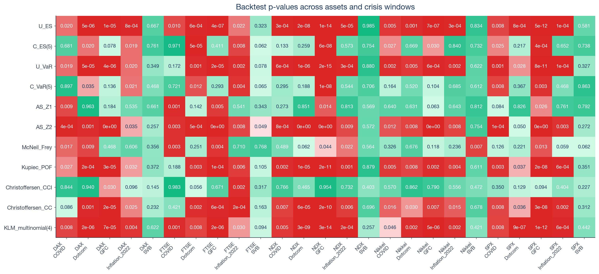
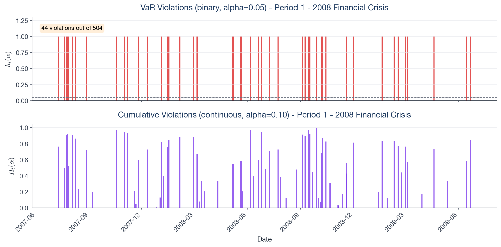
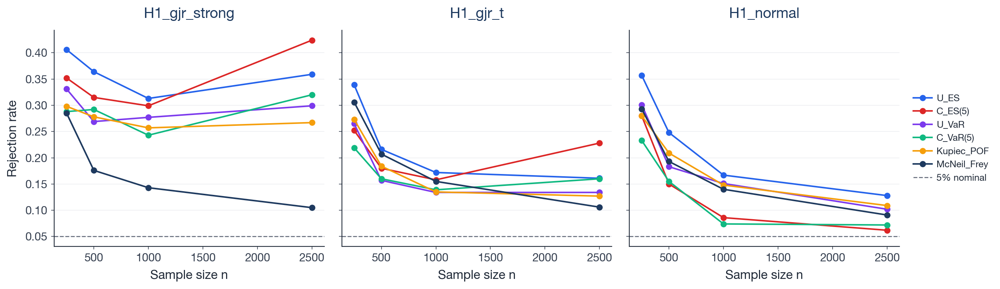
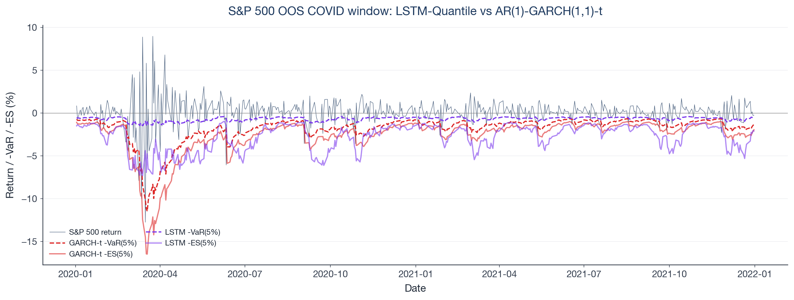
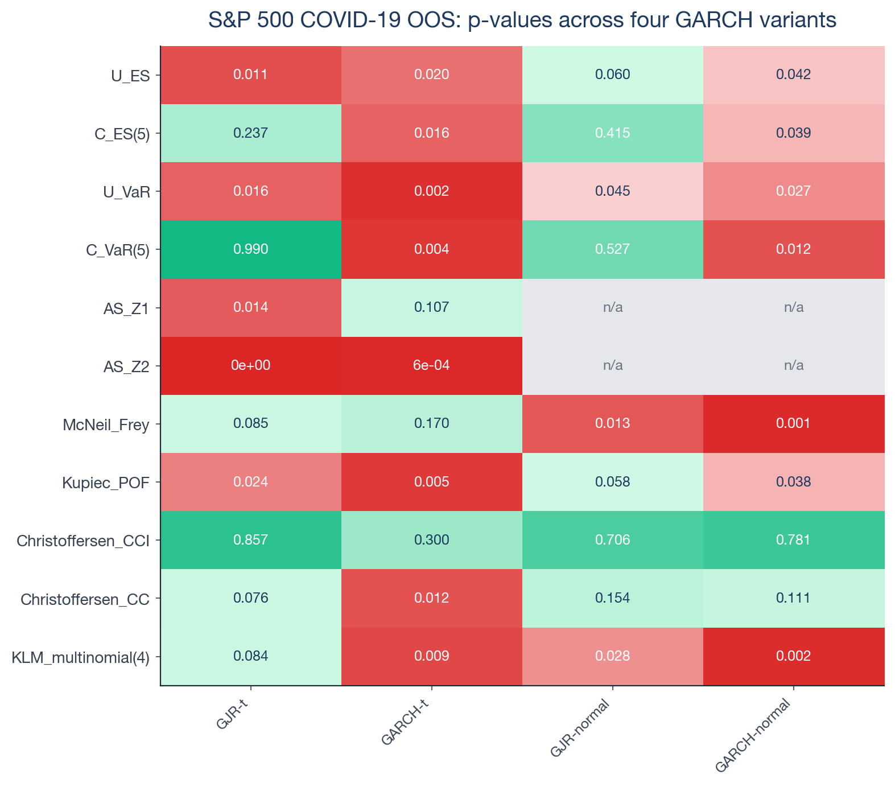
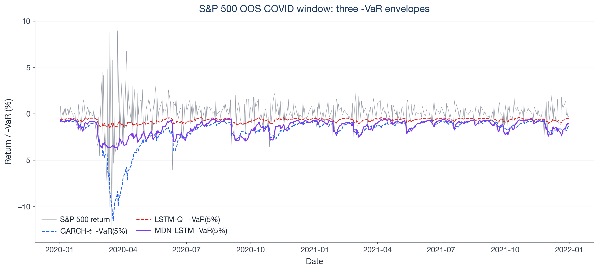

<p align="center">
  
</p>

# esback

A unified Python framework for backtesting Expected Shortfall.

Eleven ES and VaR backtests, four GARCH variants, two LSTM baselines, five equity indices, five crisis windows, and a Monte Carlo size-and-power study under one roof.

[](https://www.python.org/)
[](LICENSE)
[](https://github.com/astral-sh/ruff)
[](https://mypy.readthedocs.io)
[](tests/)

## TL;DR

- **Eleven ES / VaR backtests** on the same out-of-sample slice — Du-Escanciano (basic + robust), Acerbi-Szekely Z1 / Z2, Kratz-Lok-McNeil multinomial, Kupiec POF, Christoffersen CCI / CC, McNeil-Frey bootstrap — all returning a unified `BacktestResult`.
- **Five indices × five crises = 275 p-values** in a single grid (S&P 500, Nasdaq 100, FTSE 100, DAX, Nikkei 225 × Dotcom, Global Financial Crisis, COVID-19, Inflation 2022, SVB).
- **Monte Carlo size-and-power study** on 16,000 simulated paths, with the Acerbi-Szekely parametric Monte-Carlo simulator wired through every replication.
- **Two neural baselines** evaluated on the same battery: an LSTM-Quantile head and a mixture-density LSTM (MDN-LSTM) that exposes the analytic CDF, unlocking the full eleven-test battery on the neural model.
- **Four-variant GARCH sensitivity** isolating which test verdicts are driven by the forecasting model versus by the test itself.

A 23-page research report ([`report/main.pdf`](report/main.pdf)) reproduces every number from the codebase.

## Repository layout

```
expected-shortfall-backtesting/
├── src/esback/         Python package: backtests, models, simulation, viz, CLI
├── tests/              181 unit + integration tests (regression-pinned to 1e-10)
├── notebooks/          6 executed Jupyter notebooks (01 single-asset → 06 MDN)
├── configs/            2 YAML configs (single-asset replication, multi-asset grid)
├── docs/               methodology.md, results.md, reproducibility.md
├── report/             LaTeX research report (main.tex + refs.bib + main.pdf)
├── references/         Source paper: Du & Escanciano (2015) working paper PDF
├── assets/figures/     10 publication-ready PNG figures used by the gallery
├── pyproject.toml      Package metadata + dev dependencies
└── README.md           This file
```

## Table of contents

- [Quick start](#quick-start)
- [Reproducing the report](#reproducing-the-report)
- [Gallery](#gallery)
- [Key empirical findings](#key-empirical-findings)
- [Backtest battery](#backtest-battery)
- [Documentation](#documentation)
- [Architecture](#architecture)
- [Citations](#citations)
- [License](#license)

## Quick start

```bash
git clone <this-repo>
cd expected-shortfall-backtesting
python -m venv .venv && source .venv/bin/activate
pip install -e ".[dev]"
pytest                                # 181 tests, < 10 s
```

### Run the CLI

```bash
esback replicate    -c configs/replication_du_escanciano.yaml   # ~2 s
esback multi-asset  -c configs/multi_asset_crisis.yaml          # ~3 min
```

Sample CLI output:

```
[INFO] Loading sp500 data from 1997-01-01 to 2024-12-31
[INFO]   7044 observations available
[INFO] Running period: Period 1 - 2008 Financial Crisis
[INFO]   Done: 4 basic, 2 robust, 13 full-battery results
[INFO] Running period: Period 2 - COVID-19 Crash
[INFO]   Done: 4 basic, 2 robust, 13 full-battery results
[INFO] Wrote figures to results/figures and tables to results/tables
```

### Run the notebooks

```bash
python -m ipykernel install --user --name=esback --display-name="esback"

# Single notebook
jupyter nbconvert --to notebook --execute --inplace \
  --ExecutePreprocessor.kernel_name=esback \
  notebooks/01_replication.ipynb

# All six notebooks in order
for nb in 01_replication 02_multi_asset_battery 03_power_study \
          04_neural_baseline 05_multi_model 06_mdn_baseline; do
  jupyter nbconvert --to notebook --execute --inplace \
    --ExecutePreprocessor.timeout=7200 \
    --ExecutePreprocessor.kernel_name=esback \
    "notebooks/${nb}.ipynb"
done
```

The Monte Carlo notebook (`03_power_study.ipynb`) takes roughly twenty-five minutes; every other notebook completes in under five.

## Reproducing the report

The LaTeX source is in `report/main.tex` and renders against `report/refs.bib`. To rebuild the PDF from a clean state:

```bash
cd report
pdflatex -interaction=nonstopmode main.tex
bibtex   main
pdflatex -interaction=nonstopmode main.tex
pdflatex -interaction=nonstopmode main.tex
```

A pre-built copy lives at [`report/main.pdf`](report/main.pdf) (23 pages, Times-like newpx font).

## Gallery

|  |  |
|---|---|
|  |  |
| → [`01_replication.ipynb`](notebooks/01_replication.ipynb) | → [`02_multi_asset_battery.ipynb`](notebooks/02_multi_asset_battery.ipynb) |
|  |  |
| → [`03_power_study.ipynb`](notebooks/03_power_study.ipynb) | → [`04_neural_baseline.ipynb`](notebooks/04_neural_baseline.ipynb) |
|  |  |
| → [`05_multi_model.ipynb`](notebooks/05_multi_model.ipynb) | → [`06_mdn_baseline.ipynb`](notebooks/06_mdn_baseline.ipynb) |

## Key empirical findings

- **The choice of test is not innocent.** On the same out-of-sample slice, the eleven tests disagree on three of the thirteen statistics on every crisis window. Single-statistic ES backtesting is operationally fragile.
- **Marginal vs conditional coverage is not redundant.** The `LR_CC = LR_POF + LR_IND` decomposition is exact and on real crises the rejection signal is carried almost entirely by `LR_POF`, not by the independence component.
- **`AS_Z2` dominates `AS_Z1`.** Under strong asymmetric leverage at $n=1{,}000$, $Z_2$ rejects 23 % of paths while $Z_1$ rejects 12 %. The two are often grouped under "the Acerbi-Szekely test" but behave very differently.
- **Marginal-coverage tests over-reject at moderate $n$.** Under correctly-specified DGP at $n=1{,}000$, empirical sizes are $0.16$ for $U_{ES}$ and McNeil-Frey, $0.14$ for $U_{VaR}$ and $Z_2$, against a $5\%$ nominal level. Asymptotic critical values reach their target only at substantially larger sample sizes.
- **Neural baselines do not generalise across volatility regimes.** Trained on the calm 2010–2019 decade, the LSTM-Quantile rejects the Kupiec POF test on COVID-19 with a statistic twenty times the GARCH-$t$ value; the MDN-LSTM closes most of the gap (factor 2.8) by learning a parametric Student-$t$ output.
- **The GARCH variant choice is part of the backtest.** Holding the OOS slice and the test battery fixed, swapping symmetric `GARCH(1,1)` for asymmetric `GJR(1,1,1)` flips five of the eleven verdicts on the same data.

The full numerical write-up is in [`docs/results.md`](docs/results.md) and in the [report](report/main.pdf).

## Backtest battery

| Test | Reference | Targets | Asymptotic null | Module |
|---|---|---|---|---|
| `U_ES`, `C_ES(m)`, `MU_ES`, `MC_ES(m)` | Du, Escanciano (2017) | ES (uncond. + cond., basic + robust) | N(0,1), chi2(m) | `backtests/du_escanciano.py` |
| `U_VaR`, `C_VaR(m)` | Du, Escanciano (2017) | VaR (uncond. + cond.) | N(0,1), chi2(m) | `backtests/du_escanciano.py` |
| `AS_Z1`, `AS_Z2` | Acerbi, Szekely (2014) | ES (parametric MC p-value) | sim | `backtests/es_baselines.py` |
| `KLM_multinomial(K)` | Kratz, Lok, McNeil (2018) | ES via multi-level VaR | chi2(K) | `backtests/var_baselines.py` |
| `Kupiec_POF` | Kupiec (1995) | VaR proportion-of-failures | chi2(1) | `backtests/var_baselines.py` |
| `Christoffersen_CCI`, `Christoffersen_CC` | Christoffersen (1998) | VaR independence + cond. coverage | chi2(1), chi2(2) | `backtests/var_baselines.py` |
| `McNeil_Frey` | McNeil, Frey (2000) | ES via standardised exceedances | bootstrap | `backtests/es_baselines.py` |

`backtests.battery.run_full_battery` evaluates all eleven statistics on a single OOS slice and returns a `dict[str, BacktestResult]`. With a fitted model supplied it additionally runs the two robust Du-Escanciano variants, for thirteen statistics per period.

## Documentation

- [**docs/methodology.md**](docs/methodology.md) — notation, the eleven backtests in detail, the forecasting models (AR(1)-GARCH(1,1)-$t$, GJR-GARCH, LSTM-Quantile, MDN-LSTM), and the Monte Carlo design.
- [**docs/results.md**](docs/results.md) — headline numbers, tables, and discussion for each of the six notebooks.
- [**docs/reproducibility.md**](docs/reproducibility.md) — install, CLI, frozen reference data, regression-test setup, determinism caveats.
- [**references/`du_escanciano_2015_working_paper.pdf`**](references/du_escanciano_2015_working_paper.pdf) — the source paper this project replicates.

## Architecture

```
src/esback/
├── config.py / _logging.py                  Project foundations
├── data/{cache,loaders}.py                  yfinance + parquet cache
├── models/
│   ├── ar1_garch_t.py                       AR(1)-GARCH(1,1)-t + shared recursion helper
│   ├── garch_variants.py                    GJR-GARCH and Normal innovations
│   ├── base.py                              ModelFit dataclass + RiskModel Protocol
│   └── dl/
│       ├── lstm_quantile.py                 LSTM-Quantile head (pinball + FZ0 loss)
│       ├── lstm_mdn.py                      LSTM-MDN head (Student-t parameters, NLL loss)
│       └── losses.py                        Pinball + FZ0 loss functions
├── pit.py                                   PIT residuals (t and Normal)
├── risk_measures.py                         Cached VaR/ES analytics
├── backtests/
│   ├── base.py                              BacktestResult dataclass
│   ├── du_escanciano.py                     Du-Escanciano (2017) statistics
│   ├── var_baselines.py                     Kupiec, Christoffersen, KLM
│   ├── es_baselines.py                      Acerbi-Szekely, McNeil-Frey, ESSimulator protocol
│   └── battery.py                           Unified eleven-test entry point
├── reporting/tables.py                      DataFrame helpers
├── viz/{style,figures}.py                   Modern-quant palette + figure library
├── pipeline.py                              Single-period orchestration
├── multi_asset.py                           (asset, period) grid
├── multi_model.py                           (vol, dist) grid
├── simulation/{dgp,power_study}.py          Monte Carlo size/power study
└── cli.py                                   Typer "replicate" + "multi-asset"
```

The full source is type-checked under `mypy` and linted under `ruff`; the 181-test suite (158 unit + 23 integration, with 12 regression tests pinned to $10^{-10}$ tolerance) runs in under ten seconds.

<details>
<summary><strong>Citations</strong></summary>

```bibtex
@article{du_escanciano_2017,
  title   = {Backtesting Expected Shortfall: Accounting for Tail Risk},
  author  = {Du, Zaichao and Escanciano, Juan Carlos},
  journal = {Management Science},
  volume  = {63},
  number  = {2},
  pages   = {474--495},
  year    = {2017},
}

@article{acerbi_szekely_2014,
  title   = {Back-testing Expected Shortfall},
  author  = {Acerbi, Carlo and Szekely, Balazs},
  journal = {Risk},
  volume  = {27},
  number  = {11},
  pages   = {76--81},
  year    = {2014},
}

@article{kratz_lok_mcneil_2018,
  title   = {Multinomial VaR Backtests: A Simple Implicit Approach to Backtesting Expected Shortfall},
  author  = {Kratz, Marie and Lok, Yen Hwa and McNeil, Alexander J.},
  journal = {Journal of Banking and Finance},
  volume  = {88},
  pages   = {393--407},
  year    = {2018},
}

@article{kupiec_1995,
  title   = {Techniques for Verifying the Accuracy of Risk Measurement Models},
  author  = {Kupiec, Paul H.},
  journal = {Journal of Derivatives},
  volume  = {3},
  number  = {2},
  year    = {1995},
}

@article{christoffersen_1998,
  title   = {Evaluating Interval Forecasts},
  author  = {Christoffersen, Peter F.},
  journal = {International Economic Review},
  volume  = {39},
  number  = {4},
  pages   = {841--862},
  year    = {1998},
}

@article{mcneil_frey_2000,
  title   = {Estimation of Tail-Related Risk Measures for Heteroscedastic Financial Time Series: An Extreme Value Approach},
  author  = {McNeil, Alexander J. and Frey, Rudiger},
  journal = {Journal of Empirical Finance},
  volume  = {7},
  pages   = {271--300},
  year    = {2000},
}

@article{fissler_ziegel_2016,
  title   = {Higher Order Elicitability and Osband's Principle},
  author  = {Fissler, Tobias and Ziegel, Johanna F.},
  journal = {Annals of Statistics},
  volume  = {44},
  number  = {4},
  pages   = {1680--1707},
  year    = {2016},
}
```

</details>

## License

Dan Allouche — [MIT](LICENSE).
